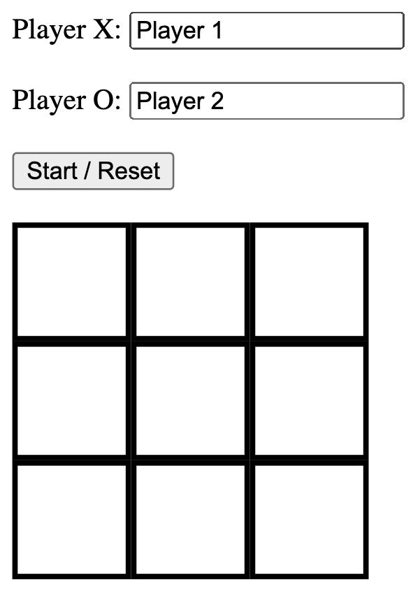

# Tic-Tac-Toe-JS

The game tic tac toe in your browser!

  

## Features

- Renamable players.
- The board knows when an end-game condition has been met.
- The board disables after the game is over.
- Includes a button to reset the board.

## Installation

1. Clone the repo onto your computer.
2. Open the index.html file within a browser.

## Demo

- https://cameronstamant.github.io/Tic-Tac-Toe-JS/
